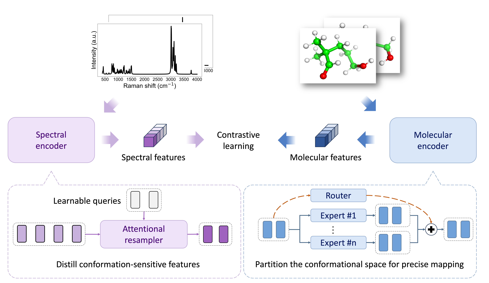

# Vib2Conf: AI-driven discrimination of molecular conformations from vibrational spectra
[](https://arxiv.org/abs/2604.24310)
[](https://huggingface.co/xinyulu/vib2conf)

## Abstract
Retrieving or generating two-dimensional molecular structures on the basis of vibrational spectra has been well demonstrated via deep learning models. However, deciphering three-dimensional molecular conformations is still challenging, primarily due to spectral ambiguities caused by conformational heterogeneity, which are difficult to resolve. To address this limitation, we propose Vib2Conf, a deep learning model directly discriminating 3D molecular conformations from vibrational spectra. We implement an attentional resampler to distill conformation-sensitive features from sparse spectral signals, and integrate Mixture-of-Experts (MoE) to partition the conformational space for precise geometric mapping. These modules enable Vib2Conf to achieve state-of-the-art top-1 recall exceeding 95% on traditional spectrum-structure benchmarks, including QM9S, VB-Mols, and QMe14S. More importantly, Vib2Conf can discriminate near-isomeric conformers with a top-1 recall of 82.06% on VB-Confs test set, where conformational isomers differ by a root-mean-square deviation (RMSD) of only ~1 Å. In general, Vib2Conf is a promising method for fine-grained spectrum-to-conformation analysis.

# Framework of Vib2Conf


# Reproduction of Results
We have provided as more as possible information for reproducing the results in this paper. You can follow the steps below.

set up the environment by
```bash
# step1: given you have pytorch installed already

# step2: install the remaining dependencies
pip install -r requirements.txt

# step3: install torch_cluster, torch_scatter, torch_sparse, torch_spline_conv and pyg_lib related to your package version
```

download the datasets and checkpoints by

```bash
pip install huggingface_hub
hf download xinyulu/vib2conf --local-dir ./
```

reproduce the results by

```bash
# example of single-GPU training
python main.py \
-train \
--launch base \
--model spec2conf_equiformer_moe_concat_balance0001 \
--ds qm9s \
--task raman

# example of multi-GPU training
torchrun \
--nproc_per_node=4 \
main.py \
--ddp \
-train \
--task raman-ir \
--model spec2conf_equiformer_moe_concat_balance0001 \
--ds vib2conf \
--use_ema \
--launch base 
```

evaluate the model by

```bash
# example of evaluation
python eval.py --ckpt_path checkpoints/vb_confs/raman/spec2conf_equiformer_moe_balance0001/2026-02-25-03-19-25bd26/epoch147.pth
```

# Additional Information
You can find the tensorboard logs in the `runs` directory. Most of figures in our manuscript are created by python scripts in the `figures.ipynb` notebook.

# Citation
Please cite our work as follow if you use our code in your research:

```bibtex
@article{lu2026vib2conf,
      title={Vib2Conf: AI-driven discrimination of molecular conformations from vibrational spectra}, 
      author={Xin-Yu Lu, De-Yi Lin, Tong Zhu, Bin Ren, Hao Ma and Guo-Kun Liu},
      year={2026},
      eprint={2604.24310},
      archivePrefix={arXiv},
      primaryClass={physics.chem-ph},
      url={https://arxiv.org/abs/2604.24310}, 
}
```

# Feedback
Please contact the authors at [xinyulu@stu.xmu.edu.cn](mailto:xinyulu@stu.xmu.edu.cn) or just submit a issue on GitHub if you have any feedback or suggestions.

