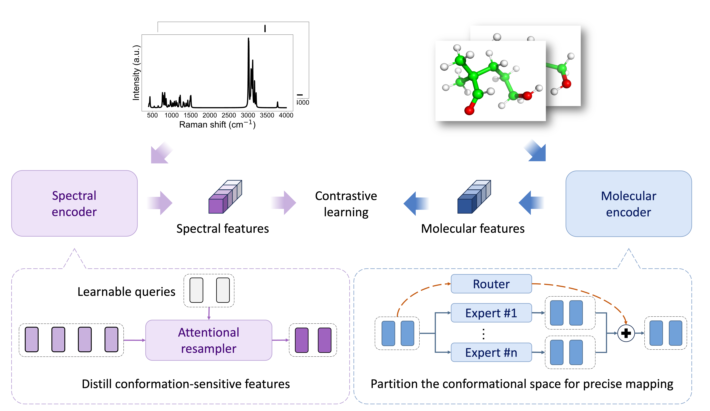

# Vib2Conf: AI-driven discrimination of molecular conformations from vibrational spectra

[](https://arxiv.org/abs/2604.24310)
[](https://huggingface.co/xinyulu/vib2conf)
[](LICENSE)

## Abstract

Retrieving or generating two-dimensional molecular structures on the basis of vibrational spectra has been well demonstrated via deep learning models. However, deciphering three-dimensional molecular conformations is still challenging, primarily due to spectral ambiguities caused by conformational heterogeneity, which are difficult to resolve. To address this limitation, we propose **Vib2Conf**, a deep learning model directly discriminating 3D molecular conformations from vibrational spectra. We implement an attentional resampler to distill conformation-sensitive features from sparse spectral signals, and integrate Mixture-of-Experts (MoE) to partition the conformational space for precise geometric mapping. These modules enable Vib2Conf to achieve state-of-the-art top-1 recall exceeding 95% on traditional spectrum-structure benchmarks, including QM9S, VB-Mols, and QMe14S. More importantly, Vib2Conf can discriminate near-isomeric conformers with a top-1 recall of 82.06% on VB-Confs test set, where conformational isomers differ by a root-mean-square deviation (RMSD) of only ~1 Å. In general, Vib2Conf is a promising method for fine-grained spectrum-to-conformation analysis.

## Framework

<p align="center">
  
</p>

## Installation

**Prerequisites:** Python 3.10+, PyTorch 2.x with CUDA.

```bash
# 1. Install dependencies
pip install -r requirements.txt

# 2. Install PyG extensions (match your PyTorch/CUDA version)
#    See: https://pytorch-geometric.readthedocs.io/en/latest/install/extension.html
pip install torch-cluster torch-scatter torch-sparse torch-spline_conv pyg_lib \
    -f https://data.pyg.org/whl/torch-<TORCH_VERSION>+cu<CUDA_VERSION>.html
```

## Dataset & Checkpoint

Download all datasets and pretrained checkpoints from HuggingFace:

```bash
pip install huggingface_hub
huggingface-cli download xinyulu/vib2conf --local-dir ./
```

This will populate the `datasets/` and `checkpoints/` directories.

## Usage

### Training

We provide reimplemented baselines (SMEN and VibraCLIP) in this repo. You can reproduce them with the following commands.

```bash
# Vib2Conf (single-modality, Raman-only)
python main.py -train \
    --launch base \
    --model vib2conf_equiformer_moe_balance0001 \
    --ds qm9s \
    --task raman

# Vib2Conf (dual-modality, Raman + IR, multi-GPU)
torchrun --nproc_per_node=4 main.py -train --ddp \
    --launch base \
    --model vib2conf_equiformer_moe_concat_balance0001 \
    --ds vb_confs \
    --task raman-ir \
    --use_ema

# SMEN baseline (multi-GPU)
torchrun --nproc_per_node=2 main.py -train --ddp \
    --task raman \
    --model smen \
    --ds qm9s \
    --launch base \
    --config smen \
    --find-unused-parameters

# VibraCLIP baseline (single-modality)
python main.py -train \
    --task raman \
    --model vibraclip \
    --ds qm9s \
    --launch base \
    --config vibraclip

# VibraCLIP baseline (dual-modality)
python main.py -train \
    --task raman-ir \
    --model vibraclip_dual \
    --ds qme14s \
    --launch base \
    --config vibraclip
```

**Key arguments:**

| Argument | Description |
|----------|-------------|
| `--model` | Model architecture name (see [Available Models](#available-models)) |
| `--ds` | Dataset name (`qm9s`, `qme14s`, `vb_confs`, `vb_mols`) |
| `--task` | Spectral modality: `raman`, `ir`, or `raman-ir` for dual-modality |
| `--launch` | Training config preset: `base`, `smen`, or `vibraclip` |
| `--use_ema` | Enable Exponential Moving Average |
| `--config` | Config preset in `config.yaml` (`base`, `smen`, `vibraclip`) |

All hyperparameters are defined in `config.yaml` and can be overridden via command-line flags (`--batch-size`, `--epoch`, `--lr`, etc.).

### Evaluation

```bash
python eval.py \
    --ckpt checkpoints/vb_confs/raman/vib2conf_equiformer_moe_balance0001/<run>/epoch147.pth \
    --save results.pickle   # optional: export DataFrame with SMILES-level analysis
```

The evaluation script outputs Recall@1/3/5 for both spectrum→molecule and molecule→spectrum retrieval directions.

### Visualization

TensorBoard logs are saved in the `runs/` directory. Figures for the paper can be regenerated via `figures.ipynb`.

```bash
tensorboard --logdir runs/
```

## Available Models

We provide implementations of models during our ablation studies and reimplementations of two existing baselines under the Vib2Conf framework for fair comparison:

| Model | Description |
|-------|-------------|
| `vib2conf_equiformer_moe_balance0001` | **Best single-modality** (Raman-only or IR-only) |
| `vib2conf_equiformer_moe_concat_balance0001` | **Best dual-modality** (Raman + IR) |
| `vib2conf_equiformer_base_*` | Standard Equiformer variants (no MoE) |
| `vib2conf_equiformer_moe_*` | MoE Equiformer variants with different expert/pooling configs |
| `smen` | EGNN + ViT with contrastive learning |
| `vibraclip` / `vibraclip_dual` | DimeNet++ + MLP with contrastive learning |

## Datasets

| Dataset | Description |
|---------|-------------|
| `qm9s` | QM9S benchmark |
| `qme14s` | QMe14S benchmark |
| `vb_confs` | VB-Confs: near-isomeric conformer discrimination (RMSD ~1 Å) |
| `vb_mols` | VB-Mols benchmark |

## Citation

```bibtex
@article{lu2026vib2conf,
      title={Vib2Conf: AI-driven discrimination of molecular conformations from vibrational spectra}, 
      author={Xin-Yu Lu, De-Yi Lin, Tong Zhu, Bin Ren, Hao Ma and Guo-Kun Liu},
      year={2026},
      eprint={2604.24310},
      archivePrefix={arXiv},
      primaryClass={physics.chem-ph},
      url={https://arxiv.org/abs/2604.24310}, 
}
```

## Acknowledgements

This repo is derived from the code of our previous work [Vib2Mol](https://github.com/X1nyuLu/vib2mol).

## Contact

Please contact the authors at [xinyulu@stu.xmu.edu.cn](mailto:xinyulu@stu.xmu.edu.cn) or [submit an issue](../../issues) for feedback or suggestions.
